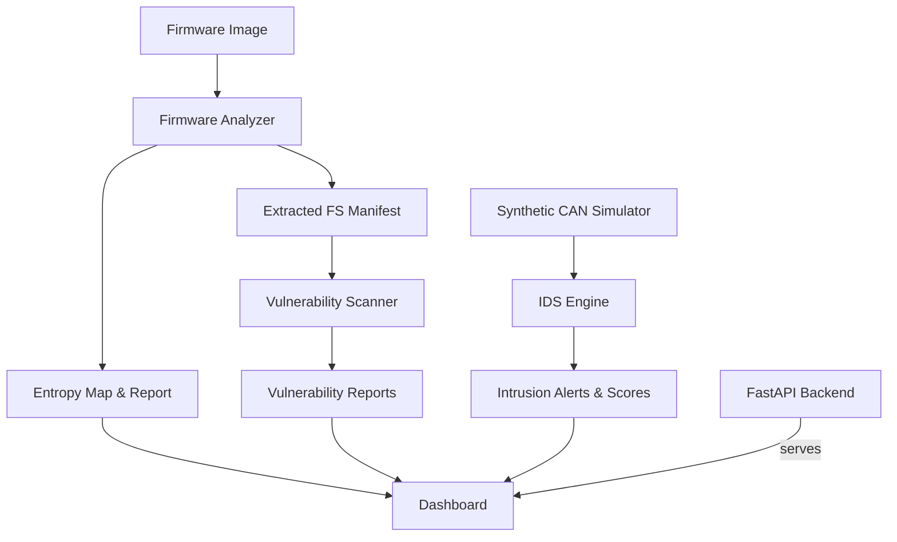

# Automotive/IoT Firmware Security Analysis & Synthetic CAN IDS

This repository provides a complete, **safe and synthetic** toolkit for firmware analysis and CAN bus intrusion detection. It includes firmware parsing, vulnerability scanning, a synthetic CAN simulator, multi-layer IDS, FastAPI backend, React dashboard scaffolding, and CI automation.

> ⚠️ **Safety:** All artifacts are synthetic. No code flashes devices or interacts with real vehicles.

## Features
- **Firmware Analyzer**: entropy mapping, string extraction, crypto/backdoor heuristics, and partition detection with synthetic extraction manifests.
- **Vulnerability Scanner**: flags weak crypto, dangerous APIs, backdoor keywords, and unsigned boot heuristics.
- **CAN Simulator**: generates normal traffic, injection, replay, and fuzzing scenarios.
- **IDS Engine**: rule-based, statistical, and machine-learning detectors (IsolationForest, One-Class SVM, RandomForest).
- **Dashboard**: React-based visualization of synthetic frames and alerts.
- **FastAPI Backend**: REST endpoints for firmware and CAN workflows.
- **CI/CD**: GitHub Actions pipeline running pytest with isolated output paths.
- **Deterministic Simulation**: optional RNG seeding for repeatable CAN traffic during tests.

## Domain Primer
- **Firmware basics**: BIN/HEX/ELF images often contain bootloaders, kernels, and root filesystems. Entropy highlights compressed/encrypted regions while strings expose config/debug hints.
- **CAN bus**: broadcast protocol for ECUs; frames contain identifier, DLC, and payload. Common IDs in this project represent RPM, speed, steering, brakes, and door locks.
- **Attack patterns**: injection (illegitimate IDs), replay (re-sent valid frames), fuzzing (malformed DLC), weak crypto, or unsigned boot chains. All scenarios are emulated offline.

## Safety Guardrails
- Only demo or synthetic firmware is analyzed.
- CAN traffic is generated locally for testing—no hardware interaction.
- Outputs are written under `OUTPUT_BASE` (default `./outputs`) to avoid accidental system modification.

## Architecture


## Repository Structure
- `firmware/` – Analyzer and vulnerability scanning modules
- `can/` – CAN simulator and IDS engine
- `backend/` – FastAPI application exposing APIs
- `dashboard/` – React dashboard (static assets)
- `docs/` – API and architecture references
- `tests/` – Pytest suite with synthetic firmware and CAN scenarios
- `scripts/` – Utility scripts and CI entrypoints
- `.github/workflows/` – CI pipeline configuration
- `.pre-commit-config.yaml` / `.editorconfig` – tooling defaults used in CI

## Setup
```bash
python -m venv .venv
source .venv/bin/activate
pip install -r requirements.txt
```

Optional: install pre-commit hooks to align with CI formatting and linting.

```bash
pre-commit install
```

## Usage
Set a dedicated output directory to keep generated artifacts isolated:
```bash
export OUTPUT_BASE=./outputs
```

- Analyze firmware:
  ```bash
  python -m firmware.analyzer tests/data/sample.hex --output ${OUTPUT_BASE}/analysis
  ```
- Scan vulnerabilities:
  ```bash
  python -m firmware.vuln_scanner ${OUTPUT_BASE}/analysis/extracted_fs --output ${OUTPUT_BASE}/scan
  ```
- Run CAN IDS demo:
  ```bash
  python - <<'PY'
  from pathlib import Path
  from can.simulator import generate_full_scenario
  from can.ids_engine import run_ids

  frames = generate_full_scenario()
  run_ids(frames, Path('${OUTPUT_BASE:-outputs}/ids'))
  PY
  ```
- Start API:
  ```bash
  uvicorn backend.main:app --reload
  ```

## API Endpoints
- `GET /health`
- `POST /analyze_firmware` (`path` to firmware)
- `POST /scan_vulnerabilities` (`extracted_fs` path)
- `POST /simulate_can`
- `POST /run_ids`
- `GET /dashboard`

See [`docs/API.md`](docs/API.md) for detailed payloads and sample responses.

## Testing
```bash
pytest
```

Lint and format checks (run locally to mirror CI):

```bash
./scripts/lint.sh
```

CI runs the same command inside GitHub Actions on every push/PR.

## Development
- Format/lint: configure tools via `pyproject.toml` (Black, isort, Ruff conventions).
- Outputs: honor `OUTPUT_BASE` to isolate generated artifacts.
- Logging: INFO-level logging enabled across analyzers, scanner, and backend.

## Security Notes
- Only synthetic data is generated; no flashing or hardware operations occur.
- Input validation and logging are enabled for transparency.
- Weak crypto/backdoor detections are heuristic and for educational use.
- Supply chain: pinned Python toolchain in CI, lint/test before merge.

## License and Governance
- Licensed under the terms in [LICENSE](LICENSE).
- See [CODE_OF_CONDUCT.md](CODE_OF_CONDUCT.md) and [CONTRIBUTING.md](CONTRIBUTING.md) for contribution expectations.
- Security reporting guidance is in [SECURITY.md](SECURITY.md).
